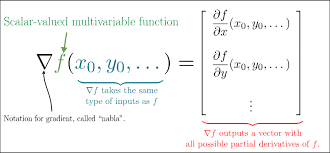
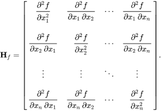

# Week 4

## Lecture 1: Introduction to Optimization

### What is Optimization?

An optimization problem consists of **maximizing** or **minimizing** a real function by systematically choosing input values from within an allowed set and computing the value of the function.

### Univariate Optimization

#### Conditions for Local Optimum for Univariate Optimization

x\* is said to be a **minimizer** of the function f(x)

- First Order Necessary Condition: $f'(x^*) = 0$
- Second Order Sufficiency Condition: $f''(x^*) > 0$

## Lecture 2: Multivariate Optimization - Contour Plots

### Gradient

- Gradient is a **vector of partial derivatives**
- Gradient at a point is orthogonal to the contours
- Gradient points in the direction of greatest increase of the function
- Negative gradient points in the direction of greatest decrease of the function

### Hessian

- Hessian is a **matrix of second order partial derivatives**
- Hessian is a square matrix
- Hessian is symmetric
- Hessian is **positive definite** if all **eigenvalues** of the Hessian matrix are **positive** (> 0)
- Hessian is **negative definite** if all **eigenvalues** of the Hessian matrix are **negative** (< 0)

### Conditions for Local Optimum for Multivariate Optimization

- Sufficient Condition: $∇f(x^*) = 0$
- Hessian is positive definite: $∇²f(x^*) > 0$

## Lecture 3: Unconstrained Multivariate Optimization - Descent Direction & Movement

Iterative: $x^{k+1} = x^k + \alpha^k d^k$

where,  
x: starting point  
$\alpha$: step length  
d: descent/search direction

Also called as **Learning Rule** in Machine Learning
