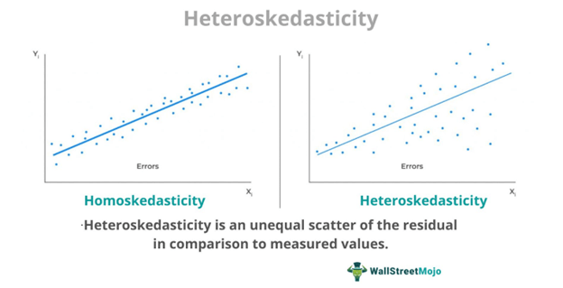

# Week 6

## Lecture 1: Predictive Modelling

### Correlation

- Measure of the linear relationship between two variables.
- Correlation does not imply causation.

1. #### Pearson Correlation Coefficient

   - Measures the **linear relationship** between two variables.
   - Ranges from -1 to 1.
   - 0 means no linear relationship.

   Formula: $\rho_{X,Y} = \frac{cov(X,Y)}{\sigma_X \sigma_Y}$

2. #### Spearman Correlation Coefficient

   - Measures the **monotonic relationship** between two variables.
   - Ranges from -1 (monotonically decreasing) to 1 (monotonically increasing).
   - 0 means no monotonic relationship.

   Formula: $1 - \frac{6 \sum d_i^2}{n(n^2 - 1)}$

   where,  
   $d_i$ is the difference between the ranks of the two variables for each observation.

3. #### Kendall Rank Correlation Coefficient

   - Correlation Coefficient to measure **association between two ordinal variables**.

   **Concordant Pair**: A pair of observations ($x_i$, $y_i$) and ($x_j$, $y_j$) such that $x_i < x_j$ and $y_i < y_j$ or $x_i > x_j$ and $y_i > y_j$.

   **Discordant Pair**: A pair of observations ($x_i$, $y_i$) and ($x_j$, $y_j$) such that $x_i < x_j$ and $y_i > y_j$ or $x_i > x_j$ and $y_i < y_j$.

   Formula: $\tau = \frac{C - D}{\frac{1}{2}n(n-1)}$

   where,  
   $C$ = no. of concordant pairs  
   $D$ = no. of discordant pairs

   The pair for which $x_i = x_j$ and $y_i = y_j$ are not considered.

## Lecture 2: Linear Regression

### Regression Basics

- **Dependent Variable**: The variable we are trying to predict.
- **Independent Variable**: The variable we are using to predict the dependent variable.

### Ordinary Least Squares (OLS)

- Minimizes the **sum of squared errors**.
- The line that minimizes the sum of squared errors is the line that minimizes the distance between the line and the data points.

## Lecture 3: Model Assessment

## Lecture 4: Diagnostics to Improve Linear Model Fit

### Residual Plots

- Residuals are the **difference** between the **observed value** and the **predicted value**.
- Used for assessing
  - Validity of linear model
  - Normality of the errors
  - Homoscedatic v/s Heteroscedatic errors
  - 

### Normal Q-Q Plot

- Plot of sample quantiles against quantiles of a normal distribution.
- Quantile (or percentile) is the value below which a certain percentage of observations fall.

### Outliers

- Points which do not conform to the general pattern of the data.
- For 5% level of significance, a sample is considered an outlier if it is more than 1.96 standard deviations away from the mean. (i.e., it lies outside [-1.96, 1.96]) (can be approximated to [-2, 2])

## Lecture 5: Simple Linear Regression Modelling

See the code [simple_linear_regression_modelling.r](./2_simple_linear_regression_modelling.r)

## Lecture 6: Simple Linear Regression Model Assessment

See the code [simple_linear_regression_modelling.r](./2_simple_linear_regression_modelling.r)

## Lecture 7: Multiple Linear Regression

1. Sum of Squares Total (SST) – The sum of squared differences between individual data points (yi) and the mean of the response variable (y).

   $SST = Σ(yi – y)^2$

2. Sum of Squares Regression (SSR) – The sum of squared differences between predicted data points (ŷi) and the mean of the response variable(y).

   $SSR = Σ(ŷi – y)^2$

3. Sum of Squares Error (SSE) – The sum of squared differences between predicted data points (ŷi) and observed data points (yi).

   $SSE = Σ(ŷi – yi)^2$

## Formula For R²

$R² = \frac{SSR}{SST} = 1 - \frac{SSE}{SST}$

where,  
$SSR$ = Sum of Squares Regression  
$SSE$ = Sum of Squares Error  
$SST$ = Sum of Squares Total  
$SST = SSR + SSE$  
$R²$ = Coefficient of Determination

## Adjusted R²

$R²_{adj} = 1 - \frac{SSE/(n-p-1)}{SST/(n-1)}$

where,
$n$ = no. of observations
$p$ = no. of independent variables  
$R²_{adj}$ = Adjusted Coefficient of Determination

## y = $β_0 + β_1x$

- $β_0$ = Intercept
- $β_1$ = Slope
- $x$ = Independent Variable
- $β_0 + β_1x$ = Predicted Value
- $y$ = Dependent Variable

$β_1 = \frac{S_{xy}}{S_{xx}}$

where,  
$S_{xy} = Σ(x_i - \bar{x})(y_i - \bar{y})$  
$S_{xx} = Σ(x_i - \bar{x})^2$

$β_0 = \bar{y} - β_1\bar{x}$

where,  
$\bar{x}$ = Mean of $x$  
$\bar{y}$ = Mean of $y$
