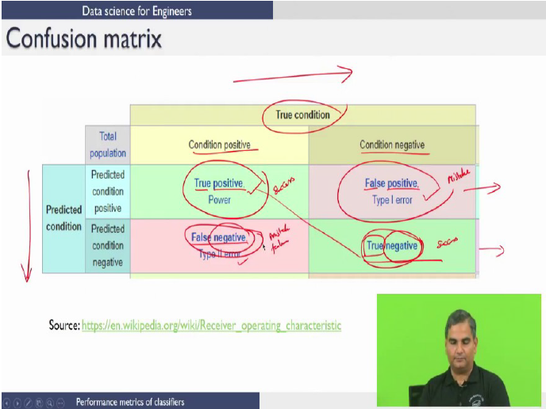

# Week 7

## Lecture 1: Cross Validation

1. **Training Set**: Used to `train` the model
2. **Validation Set**: Used to `tune` the model
3. **Test Set**: Used to `evaluate` the model

### Validation Set Approach

- Split the data into training and validation sets
- Fit the model on the training set
- Evaluate the model on the validation set
- Repeat the process with different training/validation set splits
- Select the model with the lowest validation set error

#### Advantages

- Simple to implement
- Computationally inexpensive
- Easy to understand

### Leave One Out Cross Validation (LOOCV)

- A method of cross validation where we leave one observation out of the training set and use it as the validation set.
- We repeat this process until each observation has been used as the validation set.
- We then average the results to get the LOOCV estimate.

#### Advantages

- Less bias comparison compared to the validation set approach. (Training set contains $n-1$ observations each iteration)
- Yield the same results (No randomness in the training/validation set split)
- Does not overestimate the test error rate as much as the validation set approach

#### Disadvantages

- Expensive to implement due to fitting happens $n$ times
- It may select a model of excessive size (more variables) than the optimal model

### k-Fold Cross Validation

- A method of cross validation where we randomly split the training set into **$k$ groups** of approximately equal size.
- The first group is treated as the validation set and the model is fit on the remaining $k-1$ groups.
- We repeat this process $k$ times, each time using a different group as the validation set.
- We then average the results to get the k-fold CV estimate.

 

- If $k$ = $n$, we get LOOCV
- If $k$ = 5 or 10, we get 5-fold or 10-fold CV (most common)
- Less computation cost

- LOOCV fits the model $n$ times
- k-fold CV fits the model $k$ times

## Lecture 2: Multiple Linear Regression Model Building and Selection

Refer this code: [multiple_linear_regression](./2_multiple_linear_regression.r)

## Lecture 3: Classification

Assigning classes to data points

## Lecture 4: Logistic Regression

- Classification technique
- Decision boundary derived based on probability interpretation

### Binary Classification

- No. of categories = 2
- Simple Yes/No, True/False, 0/1

Qualititave inputs ("Yes", "No") are to be converted to quantitative inputs (1, 0) for logistic regression.

### Linear Classifier

- Decision function is linear
- Binary classification can be performed based on the side of the half-plane that the data falls in

### Logit Model

- p(x) = $\frac{1}{1 + e^{-(\beta_0 + \beta_1x)}}$
- If $\beta_0 + \beta_1x$ is non-negative, and $p(x) > 0.5$, then we predict $Y = 1$
- else, we get $p(x) < 0.5$ and predict $Y = 0$
- Decision boundary is the equation: $\beta_0 + \beta_1x$

### Regularization

- When large no. of independent variables are present, logistic regression tends to overfit. To prevent this, we need to penalize the coefficients. This is called regularization.

## Lecture 5: Performance Measures

Terminology:

- TP: True Positive
- TN: True Negative
- FP: False Positive (Type I Error)
- FN: False Negative (Type II Error)
- N = TP + TN + FP + FN (Total no. of observations)
- Total no. of TP labels = TP + FN
- Total no. of TN labels = TN + FP

### Measures of Performance

- **Accuracy**: Overall effectiveness of a classifer

  - $\frac{TP + TN}{N}$

- **Precision**: Ratio of true positives to all positive predictions

  - $\frac{TP}{TP + FP}$

- **Recall**: Ratio of true positives to all positive labels

  - $\frac{TP}{TP + FN}$

- **F1 Score**

  - $\frac{2 * precision * recall}{precision + recall}$

- **Sensitivity**: Effectiveness of a classifer to identify positive labels

  - $\frac{TP}{TP + FN}$

- **Specificity**: Effectiveness of a classifer to identify negative labels

  - $\frac{TN}{TN + FP}$

- **Balanced Accuracy**: Average of sensitivity and specificity

  - $\frac{sensitivity + specificity}{2}$

- **Prevalence**: How often does the yes class occur in the data

  - $\frac{TP + FN}{N}$

- **Positive Predictive Value (PPV)**: How often does the yes prediction occur when the model predicts yes

  - $\frac{TP}{TP + FP}$

- **Negative Predictive Value (NPV)**: How often does the no prediction occur when the model predicts no

  - $\frac{TN}{TN + FN}$

- **Detection Rate**

  - $\frac{TP}{N}$

- **Detection Prevalence**

  - $\frac{TP + FP}{N}$

- **Kappa Statistic**: Compares observed accuracy with expected accuracy

  - $\frac{observed accuracy - expected accuracy}{1 - expected accuracy}$

- **Observed Accuracy (OA)** = $\frac{a + d}{N}$

- **Expected Accuracy (EA)** = $\frac{(a + b)(a + c) + (c + d)(b + d)}{N^2}$

- **Misclassification Rate** = $\frac{FP + FN}{N}$

where,  
a = TP  
b = FP  
c = FN  
d = TN

### ROC (Receiver Operating Characteristic) Curve

## Lecture 6: Logistic Regression Implementation in R

Refer this code: [logistic_regression](./3_logistic_regression.r)
